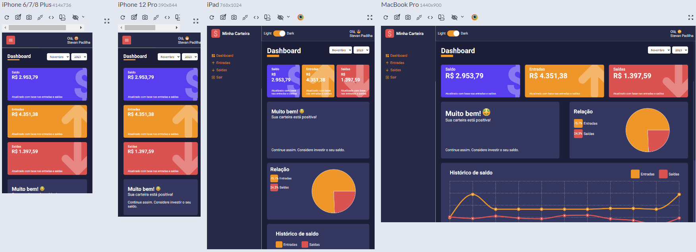
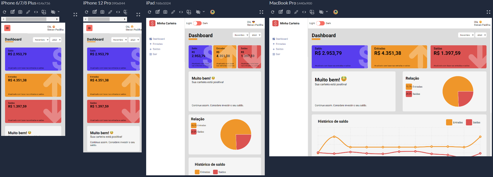

## Sobre o projeto
Este projeto foi criado com o objetivo de proporcionar uma solução eficaz para o controle e organização das finanças pessoais, permitindo que os usuários acompanhem com precisão as entradas e saídas de dinheiro ao longo do mês.

## Como instalar e rodar a aplicação

1- Clone o repositório em sua máquina

2- Instale todas as dependências necessárias usando o comando `yarn` ou `yarn install`

3- Por fim use o comando `yarn start` para poder rodar a aplicação em local-host

OBS: Não há banco de dados. Os dados são carregados de 2 arquivos que contém arrays simulando os repositórios de dados.

## ACESSO
- E-mail: stevan14padilha@gmail.com
- Senha: 123

### Layout & Componentes Responsivos

#### Tema Escuro

  

#### Tema Claro

  

## Tecnologias usadas no projeto

#### Linguagens

- JAVASCRIPT
- TYPESCRIPT
- CSS

#### Framework

- REACT

#### Bibliotecas

- REACT-COUNTUP
- RECHARTS
- STYLED-COMPONENTS
- UUID

## Deploy do projeto

<a href="https://my-wallet-swart.vercel.app/">Vercel</a>

  <small>Stevan dos Santos Padilha - 2023</small>

